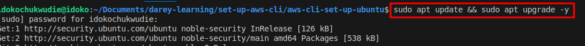
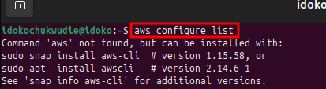
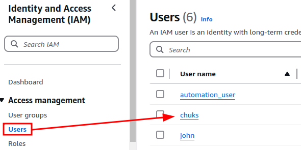
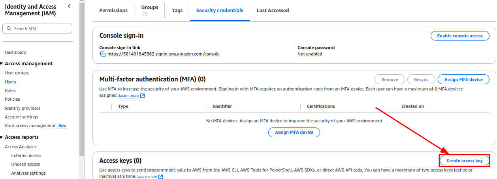
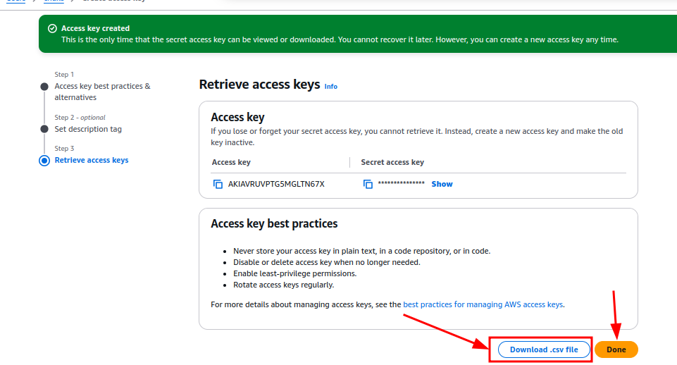
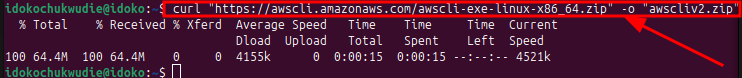
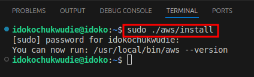
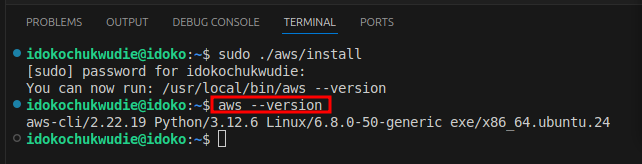
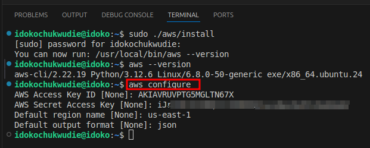
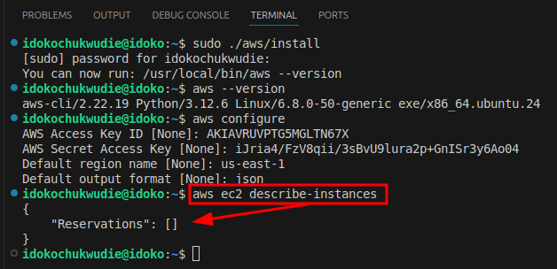

# Step-by-Step Guide to Setting Up AWS CLI on Ubuntu
This guide will walk you through the process of setting up the AWS CLI on your Ubuntu machine.

### Introduction
Setting up the AWS CLI on Ubuntu involves installing the tool, configuring it with your AWS credentials, and testing the setup. Below is a step-by-step guide.

## Step 1: Update System Packages

Ensure your Ubuntu system is up to date.

```
sudo apt update && sudo apt upgrade -y
```



This updates the system’s package lists and upgrades any existing packages to their latest versions.

To confirm if the AWS CLI has been configured on your Ubuntu machine, use the following command:

```
aws configure list
```



**Explanation:**
This command displays the details of the current AWS CLI configuration, such as the Access Key, Secret Key, Default Region, and Output Format.

If the AWS CLI is not configured, it will return an error or indicate that no configuration is found.

## Steps to Create an Access Key in AWS

1. Log in to the AWS Management Console
    - Go to the AWS Management Console.
    - Log in using your IAM user or root account credentials.

2. Navigate to the IAM Console
    - In the AWS Management Console, type IAM in the search bar and select IAM.

3. Create or Manage Access Keys
- For an IAM User:
    - In the left navigation pane, click on Users.
    - Select the username for which you want to create the access key.

    

- Go to the Security credentials tab.
- Under Access keys, click Create access key.

    

- Choose the type of access `Command Line Interface (CLI)` > `Description Tag` > `Create Access key`  `Download csv`  > `Done`.
- AWS will display the Access Key ID and Secret Access Key.

    

### For a Root User:

- Click on your account name in the top-right corner and choose My Security Credentials.
- Scroll to the Access keys for CLI, SDK, & API access section.
- Click Create New Access Key.
- AWS will display the Access Key ID and Secret Access Key.

4. Save the Access Key Securely

- Copy the Access Key ID and Secret Access Key and store them in a secure location.
- AWS will only show the Secret Access Key once during creation.

## Step 2: Install AWS CLI

**1. Download the AWS CLI Installer:**

```
curl "https://awscli.amazonaws.com/awscli-exe-linux-x86_64.zip" -o "awscliv2.zip"
```



This downloads the AWS CLI version 2 installer.

**2. Unzip the Installer:**

```
unzip awscliv2.zip
```

If unzip is not installed, use:

```sudo apt install unzip -y```

**3. Run the Installer:**

```
 sudo ./aws/install
```



This installs the AWS CLI binary and adds it to your PATH.

**4. Verify Installation:**



The output should display the installed AWS CLI version, e.g., `aws-cli/2.x.x.`

## Step 3: Configure AWS CLI

1. Run AWS Configuration Command:

    `aws-configure`

    You'll be prompted to provide the following:

    - Access Key ID: Paste your AWS Access Key.
    - Secret Access Key: Paste your AWS Secret Key.
    - Default Region: Enter your preferred AWS region (e.g., us-east-1).
    - Output Format: Choose json, table, or text (default is json).

    

2. Test Configuration:

    Use a simple command to test connectivity:

    `aws ec2 describe-instances`

    **Expected Output:**

    - If the IAM role is properly configured and has the ec2:DescribeInstances permission, you'll see a JSON-formatted list of EC2 instances in your account.
    - If there are no EC2 instances, the output will be an empty list:

    


## Conclusion
Setting up the AWS CLI on your Ubuntu machine enables you to efficiently manage AWS resources directly from the command line. This guide provided a step-by-step walkthrough of the installation, configuration, and testing process. By following these steps, you can now execute AWS commands, automate tasks, and streamline cloud operations seamlessly.

Remember to secure your Access Keys and use IAM roles wherever possible for enhanced security. With the AWS CLI configured, you're ready to take full advantage of AWS services from your Ubuntu environment.